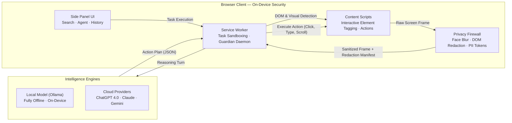

<div align="center">


# TechyMind

**The Privacy-First Autonomous Browser Agent**

*The screen the AI sees is never the screen you keep.*


<br>

**Technology Stack**


</div>

---

**TechyMind** transforms your browser into an intelligent, privacy-preserving workspace. It browses, researches, extracts structured data, and automates multi-step workflows directly from the Chrome side panel.

Unlike conventional browser agents that stream raw web pages and sensitive personal data to external clouds, TechyMind runs an on-device privacy firewall: faces are blurred, sensitive credentials are blacked out, and personal identifiers (Aadhaar, PAN, SSN, Credit Cards, Emails, Passwords) are redacted into opaque tokens **before any network request is made**.

---

## 🔒 Core Architecture



---

## ⚡ Key Capabilities

### 1. Fail-Closed Privacy Firewall
Every network-bound context passes through the on-device privacy pipeline. If any stage encounters an anomaly, the agent fails closed—sending a blank frame rather than exposing raw pixels.
- **Biometric Protection**: MediaPipe face detection sweeps the visual viewport and blurs facial regions.
- **Credential Masking**: Password fields, payment cards, CVVs, and authentication tokens are masked with solid black overlays.
- **PII Tokenization**: Checksum-validated redaction replaces sensitive identifiers with `[REDACTED:<type>]` tokens.

### 2. Autonomous Browser Navigation
- **Cursor-First Interactivity**: Discovers buttons, links, inputs, and interactive components, tagging each with visual badges for deterministic model interaction.
- **Tab-Group Sandboxing**: Isolates automated tasks into a dedicated tab group so your personal browsing remains untouched.
- **Action Verification**: Confirms state changes after every click, scroll, form fill, or navigation before proceeding.

### 3. Versatile Task Modes
- **Search & Agent**: Multi-step workflows from product comparison to automated bookings.
- **Deep Research**: Autonomous multi-tab investigative research that aggregates multiple sources into structured reports.
- **Extract Data / Scrape**: One-click extraction of web tables, lists, and articles into clean JSON or CSV.
- **Private Run**: 100% on-device mode utilizing local models (Ollama) with zero cloud network traffic.

### 4. Dedicated Settings Experience
Configure and monitor your agent in a full-tab environment:
- **AI & Models**: Connect seamlessly to Local Models (Ollama) or API gateways (ChatGPT 4.0, Claude, Gemini).
- **Privacy & Vision**: Configure live inspector modes, visual redaction styles, and inspect privacy scorecards.
- **Diagnostics**: Run automated Privacy Pipeline Tests, Service Connection verifications, and System Diagnostics.

---

## 🚀 Quick Start

### 1. Load the Extension
1. Clone or download this repository.
2. Open Chrome and navigate to `chrome://extensions`.
3. Enable **Developer mode** in the top right corner.
4. Click **Load unpacked** and select the repository root folder.
5. Pin **TechyMind** 🔒 to your extension toolbar and open the side panel.

### 2. Configure Your AI Model
Click **Settings ↗** in the top navigation to open the dedicated Settings tab:
- **Local Model (Recommended for 100% Privacy)**:
  Ensure [Ollama](https://ollama.ai) is running locally (`ollama serve`), then select your desired local model (e.g., `qwen2.5:7b`).
- **Cloud Models**:
  Enter your API key for OpenAI, Anthropic, or Google Gemini.

### 3. Run Your First Task
From the side panel home view:
- Choose from one of the quick-action cards (**Summaries**, **Extract Data**, **Deep Research**, or **Private Run**).
- Or type your task directly into the composer:
  ```text
  Find the latest release notes for Node.js and summarize the breaking changes.
  ```

---

## 📊 Measured Verification (TechyMindBench)

TechyMind includes **TechyMindBench**, a rigorous verification suite measuring privacy recall, redaction accuracy, and end-to-end reliability:

```bash
# Run the fast unit validation suite
npm run bench:unit

# Run full multi-tier benchmark (Unit, E2E, Adversarial, Browser)
npm run bench:all
```

| Metric | Result | Benchmark Tier |
|---|---|---|
| PII Precision / Recall | **1.00 / 1.00** | Checksum-validated corpus |
| Redaction Geometry (IoU) | **0.987** | Real browser pixel harness |
| Pixel Leakage Rate | **0 / 340** | Adversarial visual scan |
| Inbound Validation | **29 / 29 Pass** | Server gate security test |

---

## 🛠 Reusable Skills

TechyMind comes with pre-configured, production-ready skills:
- **Summarize Page**: Fast bullet points of the current page.
- **Deep Research**: Comprehensive multi-query web investigations.
- **Extract Data**: HTML table and list conversion to JSON/CSV.
- **Compare Prices**: Cross-site item comparison.
- **Fill Form**: Automated, privacy-guarded form submission.
- **Organize Tabs**: Clean up and cluster related tabs.
